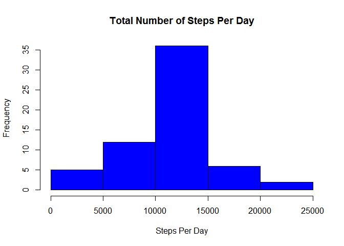

# Reproducible Research: Peer Assessment 1

## Loading and preprocessing the data


```r
    library(ggplot2)
```

```
## Warning: package 'ggplot2' was built under R version 3.1.3
```

```r
    #1. Load the data    
    unzip("activity.zip")
    data <- read.csv("activity.csv")
```

## What is mean total number of steps taken per day?


```r
    #1. Calculate the total number of steps taken per day
    stepsPerDay <- aggregate(steps~date, data=data, FUN=sum)
```

```r
    #2. Make a histogram of the total number of steps taken each day
    hist(stepsPerDay$steps,
         main="Total Number of Steps Per Day",
         xlab="Steps Per Day", col="green")
```

 

```r
    #3. Calculate and report the mean and median of the total number of steps taken per day

    #Mean total number of steps taken per day
    mean(stepsPerDay$steps)
```

```
## [1] 10766.19
```

```r
    #Median total number of steps taken per day
    median(stepsPerDay$steps)
```

```
## [1] 10765
```

## What is the average daily activity pattern?


```r
    #1. Make a time series plot (i.e. type = "l") of the 5-minute interval (x-axis) and the average number of steps taken, averaged across all days (y-axis)
    meanStepsPerInterval<-aggregate(steps~interval, data=data, FUN=mean)

    plot( meanStepsPerInterval, type = "l", xlab = "5-min interval", 
    ylab = "Average across all Days", main = "Average number of steps taken", 
    col = "red")
```

 


```r
    #2. Which 5-minute interval, on average across all the days in the dataset, contains the maximum number of steps?
    meanStepsPerInterval[meanStepsPerInterval$steps == max(meanStepsPerInterval$steps),]$interval
```

```
## [1] 835
```


## Inputing missing values


```r
    #1.Calculate and report the total number of missing values in the dataset (i.e. the total number of rows with NAs)
    completed = complete.cases(data)
    nrow(data)-sum(completed)
```

```
## [1] 2304
```


```r
    #2.Devise a strategy for filling in all of the missing values in the dataset. The strategy does not need to be sophisticated. For example, you could use the mean/median for that day, or the mean for that 5-minute interval, etc.
    #3.Create a new dataset that is equal to the original dataset but with the missing data filled in.
    newData = data
    newData[is.na(data[,1]),1] = mean(data[,1],na.rm=TRUE)
```


```r
    #4.Make a histogram of the total number of steps taken each day and Calculate and report the mean and median total number of steps taken per day. 
    newStepsPerDay <- aggregate(steps~date, data=newData, FUN=sum)
    hist(newStepsPerDay$steps,
         main="Total Number of Steps Per Day",
         xlab="Steps Per Day", col="blue")
```

 

```r
    #mean total number of steps taken per day.
    mean(newStepsPerDay$steps)
```

```
## [1] 10766.19
```

```r
    #median total number of steps taken per day.
    median(newStepsPerDay$steps)
```

```
## [1] 10766.19
```


Do these values differ from the estimates from the first part of the assignment? 

There is no significant difference from the first part.

What is the impact of imputing missing data on the estimates of the total daily number of steps?

There is not much impact as the the shape of the histogram is similar.

## Are there differences in activity patterns between weekdays and weekends?


```r
    #1.Create a new factor variable in the dataset with two levels - "weekday" and "weekend" indicating whether a given date is a weekday or weekend day.
    weekday <- weekdays(as.Date(newData$date, "%Y-%m-%d"))
    for (i in 1:length(weekday)) {
        if ((weekday[i] == "Saturday") | (weekday[i] == "Sunday")) 
            weekday[i] = "weekend" else weekday[i] = "weekday"
    }
    newData$weekday <- as.factor(weekday)
```


```r
#Make a panel plot containing a time series plot (i.e. type = "l") of the 5-minute interval (x-axis) and the average number of steps taken, averaged across all weekday days or weekend days (y-axis). 

summary <- aggregate(newData$steps, list(interval = newData$interval, day = newData$weekday), mean)
names(summary) <- c("interval", "day", "steps")

ggplot(summary, aes(interval, steps)) + geom_line(color = "blue") + facet_wrap(~day, ncol = 1) + labs(title = expression("Average number of steps taken"))
```

 

